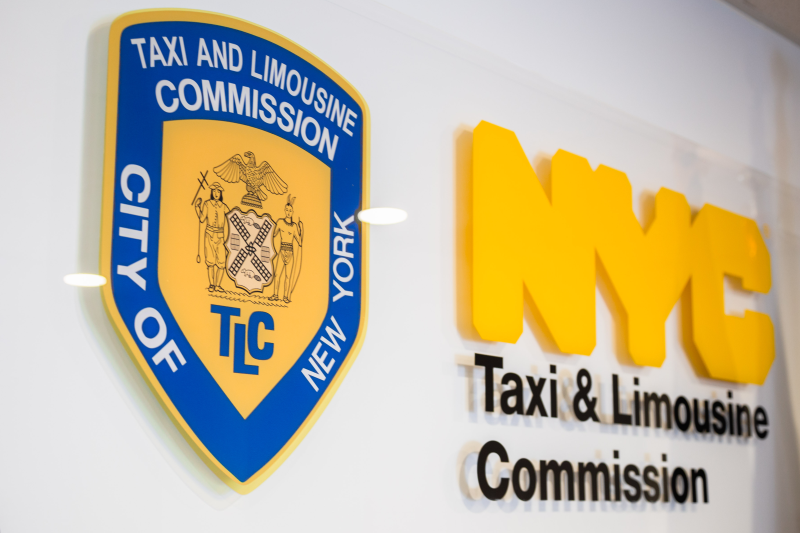

# DATA_ANALYTICS_PROJECT
Regroupe les différents projets/tips mené a bien qui concerne l'analyse de donnée

1-PROJET_AUTOMATICA Public
Ce projet se concentre sur le taux de désabonnement mensuel. Un modèle précis permettra de prévenir le désabonnement, d'améliorer la fidélisation des utilisateurs et de développer l'activité de Waze.

2-PROJET_TIKTOK Public
L'équipe chargée des données de TikTok développe un modèle d'apprentissage automatique pour classer les affirmations faites dans les vidéos soumises à la plateforme.

3-PROJET_AUTOMATICA Public
La Commission des taxis et limousines (TLC) de la ville de New York a fait appel à la société de conseil en données Automatidata pour développer une appli permettant aux usagers de la TLC d'estimer le cout de trajet aux usagers.
