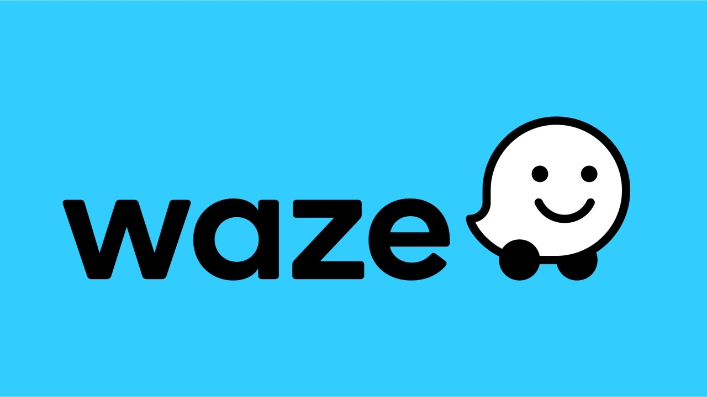

# DATA_ANALYTICS_PROJECT

Ici vous retrouverez les projets de DATA ANALYST qui ont été menés a bien.

Elles ont combinés l'utilisation d'outils tels que : 

🐍 Python                       Analyse, ML, automatisation
📒 Jupyter Notebooks            Documentation + exécution
📊 Pandas & NumPy               Nettoyage, traitement
📈 Matplolib & SeaBorn          Graphiques
🤖 Scikit-learn                 Modélisation et test
🧮 Statsmodels                  Modélisation et test
💾 SQL                          Récupération de données
🧭 Tableau & Google Sheets      Communication
⚙️ Git & GitHub                 Versioning / partage

1-PROJET_AUTOMATICA Public

Ce projet se concentre sur le taux de désabonnement mensuel.
Un modèle précis permettra de prévenir le désabonnement, d'améliorer la fidélisation des utilisateurs et de développer l'activité de Waze.

2-PROJET_TIKTOK Public

L'équipe chargée des données de TikTok développe un modèle d'apprentissage automatique pour classer les affirmations faites dans les vidéos soumises à la plateforme.

3-PROJET_WAZE Public

La Commission des taxis et limousines (TLC) de la ville de New York a fait appel à la société de conseil en données Automatidata pour développer une appli permettant aux usagers de la TLC d'estimer le cout de trajet aux usagers.
